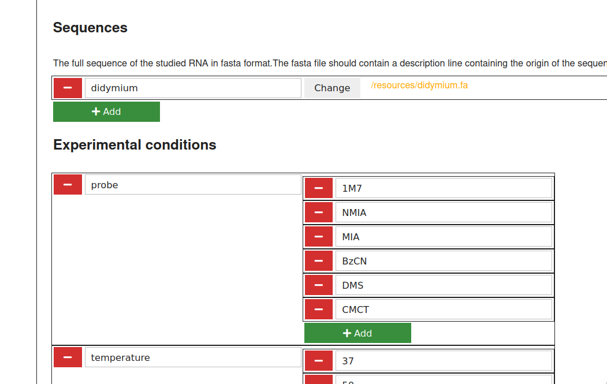

# Configuration 

To run the pipeline on your project, you must fill in 2 configuration files

- `config.yaml` Which contains general configuration
- `samples.tsv` That contains informations about samples and replicates

## 1. Fill in `config.yaml` 

Once you generated your project using `rnasique init [project]` and enter your project using `cd [project]`

Launch `rnasique config`. Fill in the form into your webbrowser and save.

More information in 

<!-- 
In order to get started with your project, you might look at thoses sections of
`config.yaml` or in the local web configurator:

sequences
: List the RNA molecules used in this project, and the path to there sequence

conditions
: List the experimental conditions which will be explored in this project

format
: Choose how the files will be named, in relation the your `conditions` section

rawdata
: If you want to import files from previous analysis, you should modify this section

qushape
: Input the configuration used with your capillary sequencer. (Channels) 

ipanemap
: Configure the execution conditions for IPANEMAP

footprint
: Configure the excutions of diffential analysisk

Others sections can stay untouch depending of your needs

To go futher : 
-->

## 2. Fill in `samples.tsv`

1. Open your project folder using a file browser
2. Open samples.tsv in libreoffice calc.
3. Create conditions columns and comments columns

    For each condition declared in `rnasique config` you must create a column with the same
identifier in samples.tsv

You can add as many columns to your `samples.tsv` as you wish, to help you classify and
caracterize your data. Each column must have un unique name. Those "comments" columns may contains arbitrary value, including empty on.

3. Create a row for each of your experiments:
For each experiment, you must create a corresponding row, and fill in the following
informations

    id (string)
    : a unique number to identity experiment
    
    rna_id (string)
    : The identifier for RNA fragment used in this experiment, as declare in the `sequences` section using `rnasique config`
    
    ddNTP (enum: ddA, ddT, ddG, ddC)
    : Which ddNTP what use for the sequencing condition of capillary eletrophorese
    
    date (date)
    : Date of the experiment. use YYYY-MM-DD 
    
    replicate (integer)
    : Replicate number for the given experiment

You must also fill every condition column.

A missing value one of the mandatory or condition column will lead to a error when launching `rnasique run`

4. Fill in file information

For each row, you must give information about where to find raw data :

probe_file (relative file path)
: relative path to the external sequencing file corresponding to this shape sample. if this field is filled in and no file is present for this sample in `results/1.1-fluo-ce` rnasique will try to import this file. `path_prefix` (from `rnasique config`) is prefixed to the content of the to construct fullpath.

control_file (relative file path)
: relative path to the external file sequencing file corresponding to the control file of this shape sample. If this field is filled in and no file is present for this sample in `results/1.1-fluo-ce` rnasique will try to import this file. `path_prefix` (from `rnasique config`) is prefixed to the content of the to construct fullpath.

reference_qushape_file (file path)
: Reference QuShape project : will be used in QuShape to pre-generate peak calling and alignment

qushape_file (relative file path)
: QuShape project : If you already treated the data outside rnasique, and want to import
those data, you can fillup this field.  If this field is filled in and no file is present for this sample in `results/2-qushape` rnasique will try to import this file. `path_prefix` (from `rnasique config`) is prefixed to the content of the to construct fullpath. This field overwrite probe_file and control_file

<!--
For each type of experimental condition, you must declare it in the `condition_names` of `config.yaml` file the name declared in the config file must be the same as the on in `samples.tsv`
In order to generate unambiguous file name, you must also add the conditions in the `format` section

#### Examples :

probe (string)
: Which probe was used in this sample (1M7, BzCN, NMIA, DMS, etc.)

temperature (int)
: temperature At which probing was
performed 

magnesium (string)
: Did the sample buffer contained Magnesium during probing (Mg / noMg)?

interaction (string)
: What other molecule/RNA was present with the probed RNA during the probing step.

### Optional columns
-->

